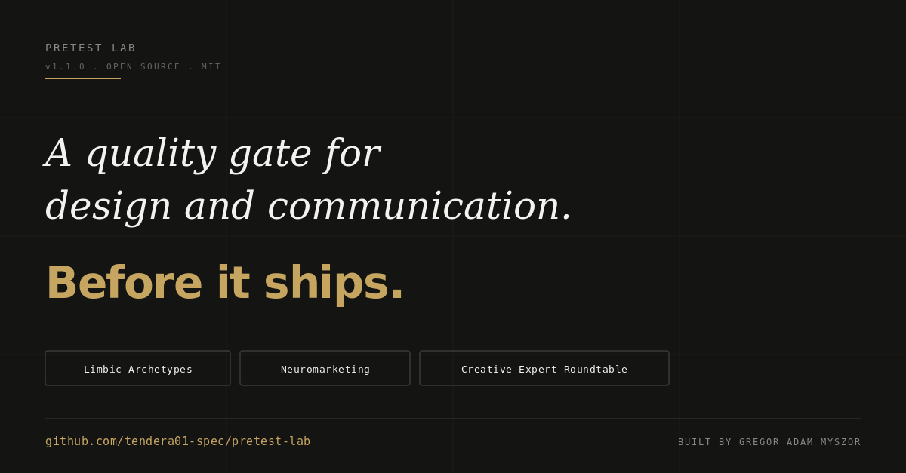

# Pretest Lab

### A pre-launch quality gate for design and communication assets.

**Test your pitch deck before you send it. Your landing page before it goes live. Your LinkedIn post before you publish.**

Communication only exists when it lands. This is the quality gate that tests whether it does, before it ships.

**Built on three established frameworks, stacked in one pass:**

- **Limbic Model** (Hans-Georg Häusel) for psychographic archetypes
- **Decoded neuromarketing** (Phil Barden, building on Daniel Kahneman) for System 1 cognition
- **Creative Expert Roundtable** (Ogilvy, Scher, Spiekermann, Cialdini, Duarte, Krug, Heath, Wells Lawrence and others) for distilled human expertise

A Claude Code skill from the [Creative Intelligence System](https://www.gregoradammyszor.com), the operating model I use in real client work. Strategy, design and execution. In the same hands. AI as accelerator. Human as decision-maker.

Built by [Gregor Adam Myszor](https://www.gregoradammyszor.com), Strategic Design Director.

---

## Run it on

Any design or communication asset that has to land with a specific audience.

- Pitch decks, investor presentations, sales decks
- Landing pages, one-pagers, brochures
- LinkedIn posts, X threads, social copy
- Ads, posters, key visuals, social creatives
- CVs, cover letters, portfolio cases
- Email templates, newsletters
- Any artefact where the work depends on the audience getting it

Upload the asset. Get back a structured report with verdict, score, archetype reactions, framework scores, expert observations and concrete fixes. Use it as a quality gate before delivery.

## The shift this makes

| Old qualitative research | Pretest Lab |
|---|---|
| 4 weeks recruiting probands | 5 minutes |
| 8.000 to 20.000 Euro per study | Free |
| Generic personas as proxy | 7 Limbic archetypes, weighted to audience distribution |
| Expert reviewers by chance | 12 documented expert lenses, selected by asset type |
| Gut feeling on cognitive response | Phil Barden's neuromarketing lens (System 1, fluency, goal value) |
| Polite agreement from colleagues | Structured critique with at least one skeptical voice |
| PDF deck three weeks later | Structured report in chat, immediately actionable |

Not a replacement for real market research. A quality gate that condenses 80 % of the qualitative value into a fraction of the time.

## Method in detail

Four phases stacked, with explicit calibration notes throughout.

**1. Archetype Panel (Limbic Model).** Three to five archetypes from the seven Limbic types (Traditionalist, Harmoniser, Hedonist, Performer, Adventurer, Disciplined, Open), embodied as concrete personas. Mix calibrated to the documented audience distribution and age shift. At least one skeptical voice. Each persona reacts in first-person, grounded in its archetype.

**2. Framework Critique.** Eight dimensions, each scored 1 to 5 with justification. Visual hierarchy, dwell-time clarity, AIDA (or Story Arc for decks and long-form), message clarity, CTA strength, premium perception, brand consistency, Limbic resonance. Weighted to the asset type.

**3. Creative Expert Roundtable.** Two to three stylised expert lenses plus a neuromarketing lens. Pool of twelve:

| Lens | Strength | When to activate |
|---|---|---|
| **David Ogilvy** | Headline, promise, clarity | Baseline, always available |
| **Bill Bernbach** | Truth, self-irony | Consumer brands, underdog positioning, cover letters |
| **Mary Wells Lawrence** | Brand theatre, dramatic staging | Bold campaigns, identity work |
| **Stefan Sagmeister** | Emotional risk, convention break | When courage is the question |
| **Dave Trott** | One thing, impact | Direct response, pitches, competitive positioning |
| **Paula Scher** | Type as identity, scale | Posters, decks, identity work |
| **Erik Spiekermann** | Type craft, hierarchy | Type-dependent work, editorial, CVs |
| **Robert Cialdini** | Six principles of influence | LinkedIn, CVs, sales-copy, persuasion |
| **Nancy Duarte** | Story-arc, deck-resonance | Pitch decks, presentations |
| **Chip & Dan Heath** | SUCCESs framework, stickiness | Messaging clarity, any sticky claim |
| **Steve Krug** | Don't-make-me-think, scanability | Landing pages, web copy |
| **Phil Barden** | Neuromarketing (System 1, cognitive fluency) | Parallel to Limbic, almost always |

Each lens delivers two sentences: observation plus implication. No fabricated quotes. The skill is explicit that these are stylised lenses on documented principles, not channelled spirits.

**4. A/B Comparison.** Only when multiple variants are uploaded. Head-to-head per dimension, clear winner, no "it depends".

## Features

- Pre-launch quality gate for design and communication assets
- Limbic Archetype panel (3 to 5 personas), calibrated to audience distribution
- 8-dimension framework critique with scores
- 12-lens Creative Expert Roundtable, dynamically selected per asset type
- Neuromarketing lens (Phil Barden, System 1 / 2, cognitive fluency)
- A/B comparison mode with clear winner
- Concrete fix list, prioritised, each tied to a solution
- "What works" callouts so revisions don't break what's already carrying weight
- Works across asset types: decks, landing pages, social posts, ads, CVs, cover letters
- Available in English (primary) and German (bonus)
- Calibration notes baked in: no overclaiming, no ventriloquism

## What this skill can NOT do

- Replace empirical market research with real probands
- Predict campaign or business performance numerically
- Test against live competitive context (training data, not live web scrape)
- Audit videos or animated assets (v1.3 on the roadmap)
- Test against non-Western markets without calibration (DE distribution is the default proxy, v1.2 plans EN, US, FR, NL distributions)

The skill is opinionated. It is a quality gate, not an oracle. Treat the output as a structured second opinion, not as truth.

## Install

### In Claude Code (recommended)

Add the repo as a plugin marketplace, then install:

```
/plugin marketplace add tendera01-spec/pretest-lab
/plugin install pretest-lab
```

### In Cowork mode or Claude Desktop

Download `pretest-lab.plugin` from the [latest release](https://github.com/tendera01-spec/pretest-lab/releases/latest) and drag it into Claude Desktop → Settings → Plugins.

### Manually (any Claude client supporting skills)

```bash
git clone https://github.com/tendera01-spec/pretest-lab.git
mkdir -p ~/.claude/skills
cp -r pretest-lab/skills/pretest-lab ~/.claude/skills/

# Optional: German version
cp -r pretest-lab/skills/pretest-lab-de ~/.claude/skills/
```

Restart Claude. The skill triggers on image or PDF uploads with phrases like "pretest this", "does this work", "review this deck", "test this poster", "which variant lands better".

## Usage

Drag any communication asset into Claude (PNG, JPG, PDF). Say something like:

> Pretest this pitch deck. Audience is Series A investors in B2B SaaS. Goal is a follow-up meeting.

Or for a landing page:

> Run a pretest on this landing page. Target audience is heads of marketing in mid-market SaaS. Goal is demo bookings.

Or A/B:

> Which variant of my LinkedIn post lands harder with design directors and creative leads?

The skill asks up to four clarifying questions if context is missing, then delivers the report.

## Example Output

See [`examples/sample-report.md`](examples/sample-report.md) for a full anonymised report.

## What you need

- Claude Code (or any Claude client that supports skills and image input)
- A communication asset to test
- Ideally: a clear target audience and goal. The skill will ask if missing.

## Roadmap

- **v1.0** Initial release: bilingual skill, Limbic panel, framework critique, A/B
- **v1.1** (current): Creative Expert Roundtable expanded to 12 lenses, archetype-driven panel, quality gate positioning, scope broadened to communication design
- **v1.2** Multi-market Limbic distributions (UK, US, FR, NL)
- **v1.3** Video and animated asset support
- **v1.4** Brand consistency scoring against uploaded brand foundation PDF
- **v1.5** Deck-specific mode: slide-by-slide flow analysis

Contributions welcome. Open an issue or PR.

## License

MIT. See [`LICENSE`](LICENSE).

## Attribution

This skill stands on the shoulders of:

- **Hans-Georg Häusel**, the Limbic Model, Limbic Map and Limbic Archetypes. *Brain View* (2014), *Limbic Success* (2018).
- **Burda Community Network**, *Typologie der Wünsche*, source for the DE distribution data.
- **Phil Barden**, *Decoded: The Science Behind Why We Buy* (2013), building on Daniel Kahneman's *Thinking, Fast and Slow*.
- **The Creative Expert Roundtable lenses** filter through publicly published books and casework of David Ogilvy, Bill Bernbach, Mary Wells Lawrence, Stefan Sagmeister, Dave Trott, Paula Scher, Erik Spiekermann, Robert Cialdini, Nancy Duarte, Chip and Dan Heath, and Steve Krug. No original quotes are fabricated. See [`references/expert-lens-principles.md`](references/expert-lens-principles.md) for the documented principles per lens.

## About the author

Gregor Adam Myszor. Strategic Design Director. 20+ years experience strategy and AI direction. Works freelance with clients across DACH, based in Munich and Zurich.

Strategy, design and execution. In the same hands. No gaps between strategy and screen.

Pretest Lab is one tool from the [Creative Intelligence System](https://www.gregoradammyszor.com), the operating model I use in client work. Protocols for decisions. Architecture for knowledge. AI as accelerator. Feedback loops for learning. It is not a theory I sell. It is how I work.

- Website: [gregoradammyszor.com](https://www.gregoradammyszor.com)
- LinkedIn: [Gregor Adam Myszor](https://www.linkedin.com/in/gregor-a-myszor-9580b722/)

If you use Pretest Lab, ping me on LinkedIn. I want to hear how it lands in the wild.
